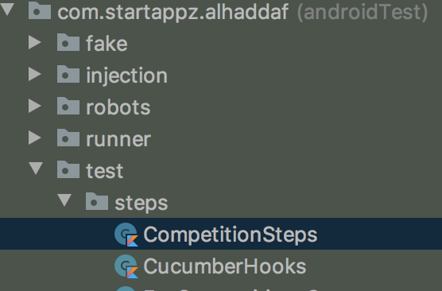

The idea of writing this post is to give you rough understanding of espresso with robot pattern combined with Cucumber and other dependencies like Mockito and JUnit, I have referred and copied content from multiple sources.

###What is Cucumber why should I use it in my project?

I think we should look at what is Behaviors Driven Development before talking about Cucumber

For further reference about [Cucumber](https://cucumber.io/docs/)

###So what is BDD(Behaviors Driven Development)?

Behavior-driven development (BDD) is an Agile software development methodology in which an application is documented and designed around the behavior a user expects to experience when interacting with it. By encouraging developers to focus only on the requested behaviors of an app or program, BDD helps to avoid bloat, excessive code, unnecessary features or lack of focus. This methodology combines, augments and refines the practices used in test-driven development (TDD) and acceptance testing, BDD can be seen as a set of best practices for writing great tests.

The benefits you can get from BDD (if you do it well) is less rework, fewer bugs and more maintainable code. In order to reap those benefits you have to invest some effort in exploring requirements and designing the software to be testable. Exploring requirements typically pays off quicker, while designing testable software tends to pay off in the long run. BDD helps teams discover mistakes quickly.

To dig more about [BDD](https://inviqa.com/blog/bdd-guide)

###What is Espresso?

Espresso is a UI test framework (part of the Android Testing Support Library) that allows you to create automated UI tests for your Android app. Espresso tests run on actual device or emulator (they are instrumentation based tests) and behave as if an actual user is using the app (i.e. if a particular view is off screen, the test won't be able to interact with it).

Espresso's simple and extensible API, automatic synchronization of test actions with the UI of the app under test, and rich failure information make it a great choice for UI testing. In many circles Espresso is considered to be a full replacement for Robotium (see this stack overflow post that compares Robotium to Espresso).

Please make sure you understood espresso before going for how to utilise robot pattern with espresso tests.

For further reference [Espresso](https://developer.android.com/training/testing/espresso)

####Now lets look at what is Robot Pattern and what problem it solve

Espresso allows us to write Android UI tests. Creating automated tests should be a part of our development process. But it is not always easy to create a full set UI tests. Robot pattern fits with Espresso and allows to create clear and understandable tests. You can see more details from its creator Jake Wharton from[Here](https://jakewharton.com/testing-robots/).

> The main aim is separating the WHAT from the HOW.

Basically a robot is a class with some methods related to actions on a view. It looks like [Builder pattern](https://www.geeksforgeeks.org/builder-design-pattern/).

For example let us look at a UI testing scenario with robot pattern and without any pattern.

```
onView(withId(resId)).perform(ViewActions.replaceText(text),ViewActions.closeSoftKeyboard())
```

The code above is for filling an **EditText** with a **String**.

If I have multiple EditTexts in the UI I'll have similar code pointing to different viewIds.

This is where robot pattern becomes handy, we can make a class which have functions that can be used on all UI components like **EditText**, **TextView**, **Button**,.. **ImageView** …etc, Like **Builder pattern** each method should return itself . So all actions can be chained step by step like in example **LoginUI test** code below.

```
   open class BaseTestRobot {

       fun fillEditText(resId: Int, text: String): ViewInteraction =
            onView(withId(resId)).perform(ViewActions.replaceText(text), ViewActions.closeSoftKeyboard())

       fun clickButton(@IdRes resId: Int): ViewInteraction {
           onView(withId(resId)).check(matches(notNullValue()))
           return onView((withId(resId))).perform(ViewActions.click())
       }

       fun textView(resId: Int): ViewInteraction = onView(withId(resId))

       fun matchText(viewInteraction: ViewInteraction, text: String): ViewInteraction = viewInteraction
            .check(ViewAssertions.matches(ViewMatchers.withText(text)))

       fun matchText(resId: Int, text: String): ViewInteraction = matchText(textView(resId), text)
    }
```

Here we have implemented a robot class for Login UI.

```
  class LoginRobot : BaseTestRobot() {
      fun setEmail(email: String) = fillEditText(R.id.et_mail, email);
      fun setPassword(pass: String) = fillEditText(R.id.et_password, pass)
      fun clickLogin() = clickButton(R.id.btnLogin)
  }
```

This is just an example to show you how robot pattern makes the test clean and clear and reuseable, you can improve it by yourself.

Hope above mentioned example gave you an insight about adavantageous of using robot pattern.

For further reference [Robot pattern by by Jake Wharton](https://academy.realm.io/posts/kau-jake-wharton-testing-robots/)

####Now lets look at cucumber and how we can combine it with espresso.

Cucumber is a tool that supports BDD, which is a variant of TDD (Test-Driven Development). With BDD, *all* the tests are customer acceptance tests, written in plain (human) language so that non-technical stakeholders can understand them. Cucumber combines requirements specifications, automated tests and living documentation into a single format called **Gherkin**, which is just plain English with a little more structure.

[Read more about Cucumber](https://cucumber.io/docs/)

####Setup of cucumber in android project

Use below dependency in app.gradle

```
  androidTestImplementation "io.cucumber:cucumber-android:$cucumberVersion"
```

```
class TestCucumberJUnitRunner : CucumberAndroidJUnitRunner() {

    @SuppressLint("MissingPermission")
    override fun onStart() {
        super.onStart()
    }

    override fun newApplication(cl: ClassLoader?, className: String?, context: Context?): Application {
        return super.newApplication(cl, TestApplication::class.java.name, context)
    }

    override fun finish(resultCode: Int, results: Bundle) {
        super.finish(resultCode, results)
    }
}
```

```
testInstrumentationRunner "com.startappz.alhaddaf.runner.TestCucumberJUnitRunner"
```

####Running Cucumber

Cucumber is a JUnit extension. It is launched by running JUnit from your build tool or your IDE.

The @CucumberOptions can be used to provide additional [configuration](https://cucumber.io/docs/cucumber/api/#list-configuration-options) to the runner it can be configured as below

```
import cucumber.api.CucumberOptions

@CucumberOptions(features = ["features"],
        glue = ["com.startappz.alhaddaf.test.steps"],
        tags = ["@e2e", "@smoke"],
        dryRun = false,
        monochrome = true
)
@SuppressWarnings("unused")
class CucumberTestCase
```

Install **Gherkin plugin** in android studio
Open ***Peferences > Plugins***, search “Gherkin” and install the plugin.

####Add sourceSets

Add this block inside **app.gradle** android block.
```
sourceSets {        
    androidTest {            
        assets.srcDirs = ['src/androidTest/assets']        
    }    
}
```

####Gherkin how to?

Gherkin uses a set of special keywords to give structure and meaning to executable specifications. Each keyword is translated to many spoken languages; I have listed some reference below which is in English.

 **Keyword** | **Description** 
---|---
 Feature | The purpose of the Feature keyword is to provide a high\-level description of a software feature, and to group related scenarios\. The first primary keyword in a Gherkin document must always be Feature, followed by a : and a short text that describes the feature\. You can add free\-form text underneath Feature to add more description\. These description lines are ignored by Cucumber at runtime, but are available for reporting \(They are included by default in html reports\)\. 
 Rule | The \(optional\) Rule keyword has been part of Gherkin since v6\. The purpose of the Rule keyword is to represent one business rule that should be implemented\. It provides additional information for a feature\. A Rule is used to group together several scenarios that belong to this business rule\. A Rule should contain one or more scenarios that illustrate the particular rule\. I'have not used rule keyword anywhere in my example but you can follow the details in cucumber website\. 
 Scenario/Example | This is a concrete example that illustrates a business rule\. It consists of a list of steps\. 
  | **Steps** :- Each step starts with **Given**, **When**, **Then**, **And**, or **But**\. Cucumber executes each step in a scenario one at a time, in the sequence you’ve written them in\. When Cucumber tries to execute a step, it looks for a matching step definition to execute\. Keywords are not taken into account when looking for a step definition\. This means you cannot have a Given, When, Then, And or But step with the same text as another step\. 
 Background | Occasionally you’ll find yourself repeating the same Given steps in all of the scenarios in a Feature         |

Look at [Cucumber docs for further reference](https://cucumber.io/docs/gherkin/reference/)

Below I've shared an example gherkin instruction for tesing email login UI , ***email_login.feature***

```
  @login
  Feature:Email login
  Email login to haddaf and logout

  Background: At home screen
    Given I am on home screen

  @smoke
  @e2e
  Scenario Outline: Invalid password entered
    Then I verify logged out state
    Then I press  on drawer login
    And I press on login with email
    Then I'm on email login screen
    When I enter email <email>
    And I enter password <password>
    Then I should see invalid password error

    Examples:
      | email                   | password |
      | test.user@test.com | incr     |

  @smoke
  @e2e
  Scenario Outline: Invalid email entered
    Then I verify logged out state
    Then I press  on drawer login
    And I press on login with email
    Then I'm on email login screen
    When I enter email <email>
    And I enter password <password>
    And I close the keyboard
    And I press login button
    Then I should see invalid email error

    Examples:
      | email | password |
      | test  | 12345678 |

  @smoke
  @e2e
  Scenario Outline: Unregistered email entered
    Then I verify logged out state
    Then I press  on drawer login
    And I press on login with email
    Then I'm on email login screen
    When I enter email <email>
    And I enter password <password>
    And I close the keyboard
    And I press login button
    Then I should see unregistered email dialog

    Examples:
      | email           | password |
      | email@email.com | 12345678 |

  @smoke
  @e2e
  Scenario Outline: Incorrect password entered
    Then I verify logged out state
    Then I press  on drawer login
    And I press on login with email
    Then I'm on email login screen
    When I enter email <email>
    And I enter password <password>
    And I close the keyboard
    And I press login button
    Then I should see incorrect password dialog

    Examples:
      | email                   | password  |
      | test.user@test.com | wrongPass |

  @smoke
  @e2e
  Scenario Outline: Valid username and password entered
    Then I verify logged out state
    And I press  on drawer login
    And I press on login with email
    Then I'm on email login screen
    When I enter email <email>
    And I enter password <password>
    And I close the keyboard
    And I press login button
    Then I should see home screen of haddaf

    Examples:
      | email                   | password |
      | test.user@test.com | 12345678 |

  @smoke
  @e2e
  Scenario: Logout from haddaf
    And I press settings from the menu
    And I should see logout button in settings
    And I press logout button
    And I pressed ok on logout dialog
    Then I verify logged out state

```

Place Gherkin files separated for features in asset folder of androidTest.

Now we can add steps in  androidTest src folder like below



We can define separate step file for different feature, step file map the gherkin instructions to a function call in Robot class for that particular UI, a step class code will look like below

```
@MediumTest
class LoginSteps {

    private val emailLoginrobot = EmailLoginRobot()
    private val socialLoginRobot = SocialLoginRobot()

    @Mock
    lateinit var mClient: TwitterAuthClient
    @Before("@sociallogin", order = 2)
    fun before() {
        MockitoAnnotations.initMocks(this)
    }

    @After("@sociallogin", order = 2)
    fun after() {

    }

    @Then("^I'm on email login screen$")
    fun onLoginWithEmailScreen() {
        emailLoginrobot.isInvoked(EmailLoginActivity::class.java.name)
        emailLoginrobot.sleep()
    }

    @Given("^I press on login with email$")
    fun pressLoginWithEmail() {
        emailLoginrobot.clickLoginWithEmail()
        emailLoginrobot.sleep()
    }
}
```

**@Mock** annotation, [mockito](https://site.mockito.org/)(Open the hyperlink for reference) is used provide mock object for testing.

**@MediumTest** This annotation is used to categorise the test and the annotation is a part of ***androidx.test:runner:###***, refer about it on [test-sizes](https://testing.googleblog.com/2010/12/test-sizes.html) 

####Cucumber Hooks

Cucumber supports hooks, which are blocks of code that run before or after each scenario. You can define them anywhere in your project or step definition layers, using the methods @Before and @After. Cucumber Hooks allows us to better manage the code workflow and helps us to reduce the code redundancy. We can say that it is an unseen step, which allows us to perform our scenarios or tests.

I have used cucumber hooks to update my test enviornment for some tests, Example the case of testing no internet I update the enviornment to behave as no internet.

    @After("@emptydata", order = 0)
    fun afterScenarioEmptyData() {
        ResponseManager.data_empty = false
    }

    @Before("@nointernet", order = 0)
    fun beforeScenarioNoInternet() {
        ResponseManager.updateNetworkStatus(false)
    }

Hope now you have an overall idea about how to integrate all these tools together and make UI testing more collaborative, understandable and reusable.


